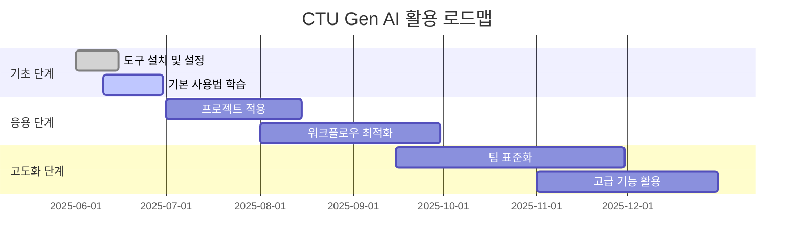

# 개요

## CTU의 Gen AI 활용 비전

CTU(Cloud Tech Unit)는 클라우드 기술과 생성형 AI의 융합을 통해 혁신적인 개발 경험을 추구합니다.

## 🎯 목표

### 단기 목표 (1-3개월)

- [ ] 팀원 모두가 AI 코딩 어시스턴트 활용 가능
- [ ] 코드 리뷰 과정에 AI 도구 통합
- [ ] 기본적인 프롬프트 엔지니어링 스킬 습득

### 중기 목표 (3-6개월)

- [ ] 프로젝트별 맞춤 AI 워크플로우 구축
- [ ] AI 기반 테스트 자동화 도입
- [ ] 문서화 자동화 시스템 구축

### 장기 목표 (6개월+)

- [ ] AI 기반 아키텍처 설계 지원 시스템
- [ ] 지능형 코드 품질 관리 시스템
- [ ] 팀 지식 베이스 AI 어시스턴트

## 🛠️ 핵심 도구

### 개발 환경

- **Cursor**: AI 통합 IDE
- **GitHub Copilot**: 코드 생성 어시스턴트
- **ChatGPT/Claude**: 범용 AI 어시스턴트

### 특화 도구

- **Codeium**: 무료 코드 완성 도구
- **Tabnine**: 팀 컨텍스트 기반 AI
- **DeepCode**: 코드 품질 분석

## 📊 성과 측정

### KPI (핵심 성과 지표)

1. **개발 속도**: 기능 구현 시간 단축률
2. **코드 품질**: 버그 발생률 감소
3. **학습 효율**: 새 기술 습득 시간
4. **팀 만족도**: AI 도구 활용 만족도

### 측정 방법

- 월간 팀 회고를 통한 정성적 평가
- GitHub 통계를 활용한 정량적 분석
- 코드 리뷰 품질 평가

## 🚀 로드맵

## 💡 기대 효과

### 개인 차원

- 반복 업무 자동화로 창의적 업무에 집중
- 새로운 기술 학습 시간 단축
- 코딩 실수 감소 및 품질 향상

### 팀 차원

- 일관된 코딩 스타일 및 품질 표준
- 코드 리뷰 효율성 증대
- 지식 공유 및 협업 개선

### 조직 차원

- 개발 생산성 향상
- 기술 혁신 가속화
- 경쟁력 있는 개발 조직 구축
