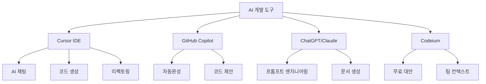

# 소개

## CTU (Cloud Tech Unit) 소개

CTU는 클라우드 기술의 혁신과 생성형 AI의 실무 활용을 선도하는 기술 조직입니다.

## 🎯 우리의 미션

> **"AI와 클라우드 기술을 통해 개발자 경험을 혁신하고, 더 나은 소프트웨어를 더 빠르게 만든다"**

## 🚀 핵심 가치

### 혁신 (Innovation)

- 최신 기술 트렌드의 빠른 도입과 실험
- 전통적인 개발 방식의 과감한 개선
- 실패를 두려워하지 않는 도전 정신

### 효율성 (Efficiency)

- AI 도구를 활용한 생산성 극대화
- 반복적인 작업의 자동화
- 개발자가 창의적 업무에 집중할 수 있는 환경 조성

### 품질 (Quality)

- AI의 도움을 받되 최종 품질은 사람이 책임
- 지속적인 학습과 개선을 통한 역량 강화
- 사용자 중심의 가치 있는 소프트웨어 개발

### 협업 (Collaboration)

- 지식과 경험의 적극적인 공유
- 팀 내 모든 구성원의 성장 지원
- 오픈소스 정신과 커뮤니티 기여

## 🌟 주요 활동 영역

### 1. AI 기반 개발 도구 연구

- Cursor, GitHub Copilot, ChatGPT 등 AI 코딩 어시스턴트 활용법 연구
- 프롬프트 엔지니어링 기법 개발
- AI 도구의 실무 적용 사례 문서화

### 2. 클라우드 아키텍처 설계

- AWS, Azure, GCP 등 주요 클라우드 플랫폼 활용
- 서버리스 아키텍처와 컨테이너 기술 적용
- DevOps 및 CI/CD 파이프라인 최적화

### 3. 개발 생산성 향상

- 코드 품질 자동화 도구 도입
- 테스팅 자동화 및 TDD 문화 확산
- 개발 워크플로우 최적화

### 4. 기술 교육 및 멘토링

- 팀 내 기술 세미나 정기 개최
- 주니어 개발자 멘토링 프로그램 운영
- 외부 커뮤니티와의 지식 공유

## 👥 팀 구성

### 기술 리더십

- **CTO**: 기술 전략 및 비전 수립
- **Tech Lead**: 아키텍처 설계 및 기술 의사결정
- **AI Specialist**: AI 도구 연구 및 도입 전략

### 개발팀

- **시니어 개발자**: 복잡한 시스템 설계 및 주니어 멘토링
- **미들 개발자**: 핵심 기능 개발 및 코드 리뷰
- **주니어 개발자**: 기능 개발 및 지속적 학습

### 운영팀

- **DevOps 엔지니어**: 인프라 자동화 및 배포 파이프라인
- **QA 엔지니어**: 품질 보증 및 테스트 자동화

## 📈 성과 지표

### 기술적 성과

- **개발 속도**: AI 도구 도입 후 평균 30% 개발 시간 단축
- **코드 품질**: 버그 발생률 40% 감소
- **학습 효율**: 새 기술 습득 시간 50% 단축
- **배포 빈도**: 주 단위에서 일 단위 배포로 개선

### 조직적 성과

- **팀 만족도**: AI 도구 활용 만족도 4.5/5.0
- **지식 공유**: 월 평균 8회 기술 세미나 개최
- **커뮤니티 기여**: 오픈소스 프로젝트 12개 기여

## 🛠️ 사용 기술 스택

### AI 개발 도구

### 클라우드 & 인프라

- **클라우드**: AWS, Azure, Vercel, Netlify
- **컨테이너**: Docker, Kubernetes
- **CI/CD**: GitHub Actions, Jenkins
- **모니터링**: Datadog, New Relic

### 프론트엔드

- **프레임워크**: React, Next.js, Vue.js
- **상태관리**: Redux, Zustand, Pinia
- **스타일링**: TailwindCSS, Styled Components
- **테스팅**: Jest, Cypress, Playwright

### 백엔드

- **언어**: TypeScript, Python, Go
- **프레임워크**: Express, FastAPI, Gin
- **데이터베이스**: PostgreSQL, MongoDB, Redis
- **메시징**: RabbitMQ, Apache Kafka

## 🎓 학습 문화

### 지속적 학습

- **Tech Talk**: 매주 화요일 오후 2시 기술 세미나
- **Study Group**: 분기별 새로운 기술 스터디 그룹 운영
- **Conference**: 주요 기술 컨퍼런스 참석 지원
- **Certification**: 클라우드 자격증 취득 지원

### 지식 공유

- **Documentation**: 모든 실험과 학습 내용 문서화
- **Code Review**: 상호 학습을 위한 적극적 코드 리뷰
- **Mentoring**: 1:1 멘토링 프로그램 운영
- **Open Source**: 사내 도구의 오픈소스 공개

## 🌐 커뮤니티 활동

### 외부 발표

- **개발자 컨퍼런스**: AI 개발 도구 활용 사례 발표
- **기술 블로그**: 주간 기술 블로그 포스팅
- **YouTube**: 개발 팁 영상 제작 및 공유

### 오픈소스 기여

- **프로젝트 기여**: 사용 중인 오픈소스 프로젝트에 적극 기여
- **도구 개발**: 사내에서 개발한 유용한 도구들 오픈소스화
- **문서화**: 한국어 번역 및 문서 개선 기여

## 📞 연락처

### 공식 채널

- **이메일**: [mzc_coe@megazone.com](mailto:mzc_coe@megazone.com)
- **GitHub**: [@ctu-tech](https://github.com/ctu-tech)
- **LinkedIn**: [CTU Tech Team](https://linkedin.com/company/ctu-tech)

### 소셜 미디어

- **Twitter**: [@ctu_tech](https://twitter.com/ctu_tech)
- **YouTube**: [CTU Tech Channel](https://youtube.com/@ctu-tech)
- **Discord**: [CTU 개발자 커뮤니티](https://discord.gg/ctu-tech)

---

## 📋 팀 합류 안내

CTU 팀에 관심이 있으시다면:

1. **포트폴리오 제출**: 최근 프로젝트와 기술 스택 공유
2. **기술 면접**: AI 도구 활용 경험과 학습 의지 평가
3. **문화 적합성**: 협업과 지식 공유에 대한 자세 확인
4. **성장 계획**: 개인 성장 목표와 팀 기여 방안 논의

우리는 항상 배우고 성장하려는 개발자들을 환영합니다! 🚀
